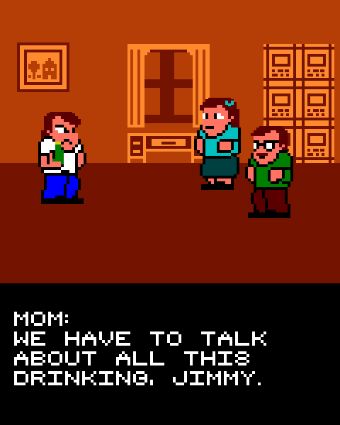

## About the game
Are you a bad enough dude to Drink 'n' Drive!? Feel the danger in this intoxicating retro racer, and find out if you can handle the power of beer and car combined! How long can you roll before you crash and die? Zigzag your way towards destiny as the captivating story of Biff unfolds. Who is he and why is he so dedicated to drinking? Featuring three levels with accompanying bosses waiting to stand in your way!

### History
"Drink'n'Drive - Immoral racing" was originally scheduled for release in 1985. The game, which at the time was intended for the Japanese market only, was known as "Dorinko Dorinko Kurasu". However, due to mysterious circumstances it was never released. Some speculate that the game was secretly banned because of the very sensitive subject of alcohol. Others think that the development team simply drank too heavily and missed the deadline.
